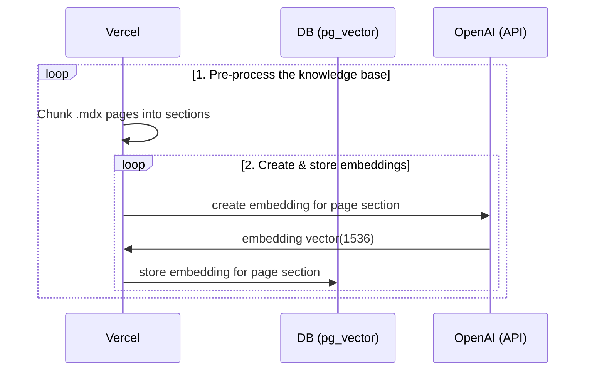
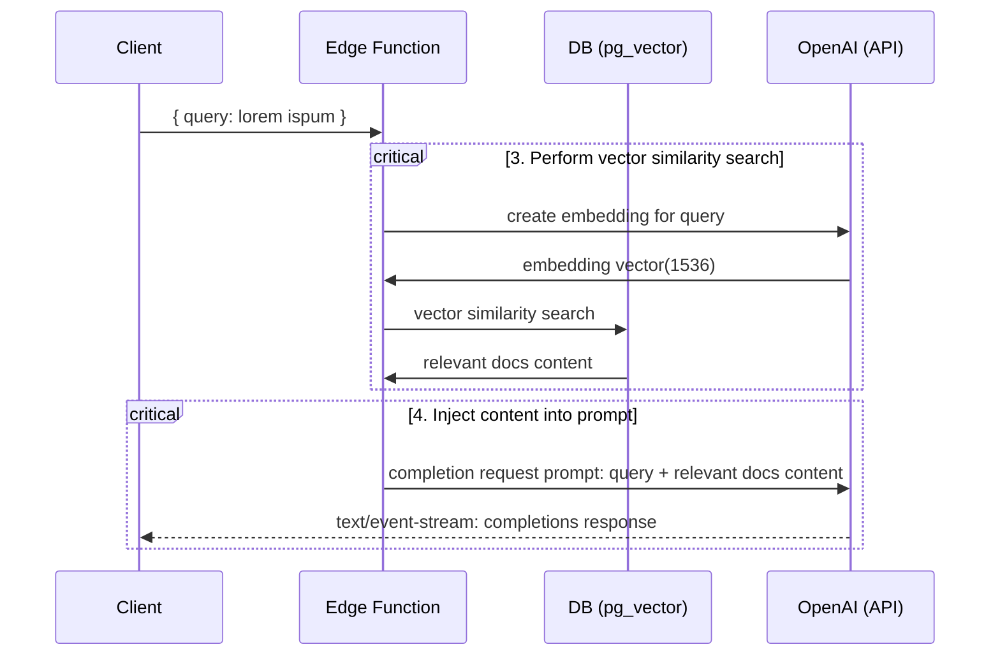

# Next.js OpenAI Doc Search Template

Building your own custom ChatGPT involves four steps:

1. [👷 Build time] Pre-process the knowledge base (your `.mdx` files in your `pages` folder).
2. [👷 Build time] Store embeddings in Postgres with [pg_vector](https://github.com/pgvector/pgvector).
3. [🏃 Runtime] Perform vector similarity search to find the content that's relevant to the question.
4. [🏃 Runtime] Inject content into OpenAI GPT-3 text completion prompt and stream response to the client.

## 👷 Build time

Step 1. and 2. happen at build time, e.g. when Vercel builds your Next.js app. During this time the [`generate-embeddings`](./app/lib/generate-embeddings.ts) script is being executed which performs the following tasks:



In addition to storing the embeddings, this script generates a checksum for each of your `.mdx` files and stores this in another database table to make sure the embeddings are only regenerated when the file has changed.

## 🏃 Runtime

Step 3. and 4. happen at runtime, anytime the user submits a question. When this happens, the following sequence of tasks is performed:



The relevant files for this are the [`SearchDialog` (Client)](./app/components/SearchDialog.tsx) component and the [`vector-search` (Edge Function)](./supabase/functions/vector-search/index.ts).

The initialization of the database, including the setup of the `pg_vector` extension is stored in the [`supabase/migrations` folder](./supabase/migrations/) which is automatically applied to your local Postgres instance when running `supabase start`.

## Setup

- `cp app/.env.example app/.env`
- `cp supabase/functions/.env.example supabase/functions/.env`
- Set your `OPENAI_KEY` in both the `app/.env` and the `supabase/functions/.env` file.

## Local Development

This repository consists of two separate workspaces:

1. `next-app`: The Next.js app
2. `supabase-functions`: Deno Supabase Edge Functions

In order for vscode to handle the workspaces correctly, open the project via the `nextjs-openai-doc-search.code-workspace` file:

```bash
code nextjs-openai-doc-search.code-workspace
```

### Start Supabase

Make sure you have Docker installed and running locally. Then run

```bash
supabase start
```

### Serve edge functions locally

```bash
supabase functions serve --env-file supabase/functions/.env
```

### Start the Next.js App

In a new terminal window, run

```bash
cd app
pnpm dev
```

## Deploy

If you don't have an existing project, create a [new Supabase Project](https://app.supabase.com/projects)!

### Sync local migrations to your Supabase instance

To sync your local database schema to your hosted Supabase instance you need to link your local project to your hosted instance using your project ref (https://app.supabase.com/project/your-project-ref):

```bash
supabase link --project-ref=your-project-ref
```

Now you can push up your local migrations:

```bash
supabase db push
```

### Deploy your Edge Function

Deploy the `vector-search` edge function to your newly linked project:

```bash
supabase functions deploy vector-search
supabase secrets set --env-file supabase/functions/.env
```

### Deploy the frontend to Vercel

To deploy the frontend, click the "Deploy with Vercel" button below. Make sure to add the Supabase integration to autimatically set up the environment variables for your project!

[](https://vercel.com/new/clone?repository-url=https%3A%2F%2Fgithub.com%2Fsupabase-community%2Fnextjs-openai-doc-search&env=NEXT_PUBLIC_SUPABASE_URL,NEXT_PUBLIC_SUPABASE_ANON_KEY,SUPABASE_SERVICE_ROLE_KEY,OPENAI_KEY&project-name=nextjs-openai-doc-search&repository-name=nextjs-openai-doc-search&root-directory=app)

## Learn More

- Read the blogpost on how we built [ChatGPT for the Supabase Docs](https://supabase.com/blog/chatgpt-supabase-docs).
- [[Docs] pgvector: Embeddings and vector similarity](https://supabase.com/docs/guides/database/extensions/pgvector)
- Watch [Greg's](https://twitter.com/ggrdson) "How I built this" [video](https://youtu.be/Yhtjd7yGGGA) on the [Rabbit Hole Syndrome YouTube Channel](https://www.youtube.com/@RabbitHoleSyndrome):

[](https://www.youtube.com/watch?v=Yhtjd7yGGGA)
