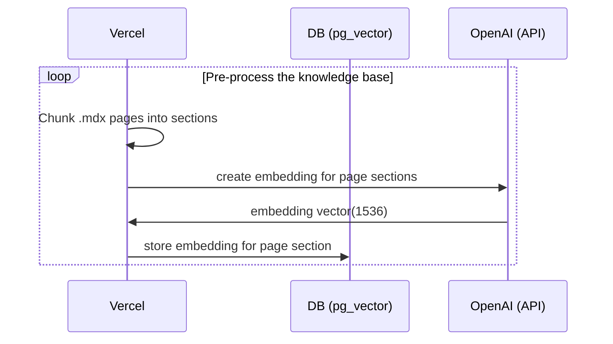
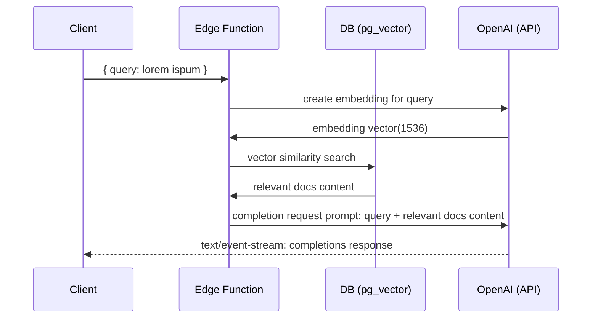

# Next.js OpenAI Doc Search Template

Building your own custom ChatGPT involves three steps:

1. [👷 Build time] Pre-process the knowledge base (your `.mdx` files in your `pages` folder).
2. [👷 Build time] Store embeddings in Postgres with [pg_vector](https://github.com/pgvector/pgvector).
3. [🏃 Runtime] Perform vector similarity search to find the content that's relevant to the question.
4. [🏃 Runtime] Inject content into OpenAI GPT-3 text completion prompt and stream response to the client.

## 👷 Build time

Step 1. and 2. happen at build time, e.g. when Vercel builds your Next.js app. During this time the [`generate-embeddings`](./app/lib/generate-embeddings.ts) script is being executed which performs the following tasks:



In addition to storing the embeddings, this script generates a checksum for each of your `.mdx` files and stores this in another database table to make sure the embeddings are only regenerated when the file has changed.

## 🏃 Runtime

Step 3. and 4. happen at runtime, anytime the user submits a question. When this happens, the following sequence of tasks is performed:



The relevant files for this are the [`SearchDialog` (Client)](./app/components/SearchDialog.tsx) component and the [`vector-search` (Edge Function)](./supabase/functions/vector-search/index.ts).

The initialization of the database, including the setup of the `pg_vector` extension is stored in the [`supabase/migrations` folder](./supabase/migrations/) which is automatically applied to your local Postgres instance when running `supabase start`.

## Setup

- `cp app/.env.example app/.env`
- `cp supabase/functions/.env.example supabase/functions/.env`
- Set your `OPENAI_KEY` in both the `app/.env` and the `supabase/functions/.env` file.

## Local Development

This repository consists of two separate workspaces:

1. `next-app`: The Next.js app
2. `supabase-functions`: Deno Supabase Edge Functions

In order for vscode to handle the workspaces correctly, open the project via the `nextjs-openai-doc-search.code-workspace` file:

```bash
code nextjs-openai-doc-search.code-workspace
```

### Start Supabase

Make sure you have Docker installed and running locally. Then run

```bash
supabase start
```

### Serve edge functions locally

```bash
supabase functions serve --env-file supabase/functions/.env
```

### Start the Next.js App

In a new terminal window, run

```bash
cd app
pnpm dev
```

## Deploy

### Sync local migrations to your Supabase instance

### Deploy your Edge Function

### Deploy the frontend to Vercel

The easiest way to deploy your Next.js app is to use the [Vercel Platform](https://vercel.com/new?utm_medium=default-template&filter=next.js&utm_source=create-next-app&utm_campaign=create-next-app-readme) from the creators of Next.js.

## Learn More
