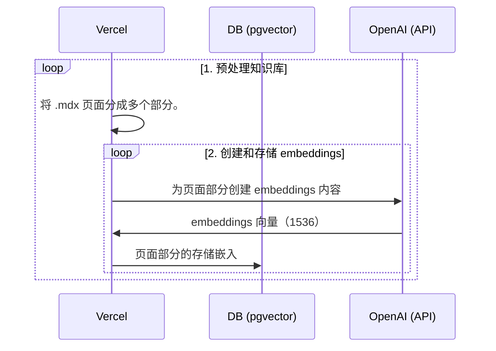
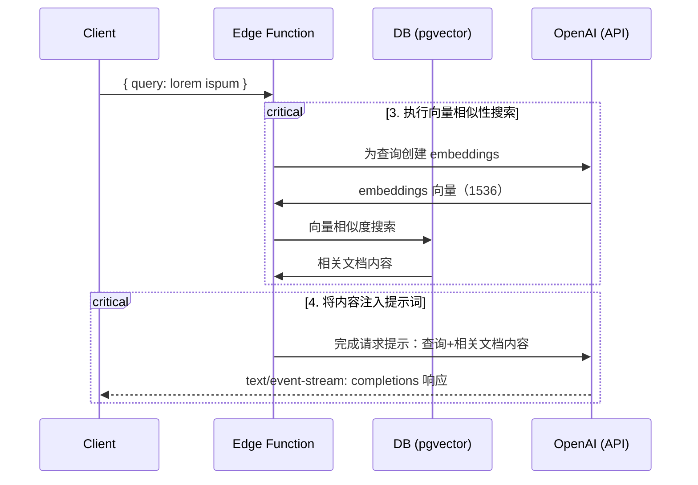

# Next.js OpenAI 文档搜索入门模板

[English](./README.md) | 简体中文

这个启动器接收 `pages` 目录下的所有 `.mdx` 文件，并对它们进行处理，作为 [OpenAI Text Completion](https://platform.openai.com/docs/guides/completion) 提示词中的自定义上下文。

## 部署

将此起始模板部署到 Vercel。Supabase 集成将自动设置所需的环境变量并配置您的 [数据库架构](./supabase/migrations/20230406025118_init.sql)。您只需要设置 `OPENAI_KEY`，就可以开始使用了！

[](https://vercel.com/new/clone?demo-title=Next.js%20OpenAI%20Doc%20Search%20Starter&demo-description=Template%20for%20building%20your%20own%20custom%20ChatGPT%20style%20doc%20search%20powered%20by%20Next.js%2C%20OpenAI%2C%20and%20Supabase.&demo-url=https%3A%2F%2Fsupabase.com%2Fdocs&demo-image=%2F%2Fimages.ctfassets.net%2Fe5382hct74si%2F1OntM6THNEUvlUsYy6Bjmf%2F475e39dbc84779538c8ed47c63a37e0e%2Fnextjs_openai_doc_search_og.png&project-name=Next.js%20OpenAI%20Doc%20Search%20Starter&repository-name=nextjs-openai-doc-search-starter&repository-url=https%3A%2F%2Fgithub.com%2Fsupabase-community%2Fnextjs-openai-doc-search%2F&from=github&integration-ids=oac_jUduyjQgOyzev1fjrW83NYOv&env=OPENAI_KEY&envDescription=Get%20your%20OpenAI%20API%20key%3A&envLink=https%3A%2F%2Fplatform.openai.com%2Faccount%2Fapi-keys&teamCreateStatus=hidden&external-id=nextjs-open-ai-doc-search)

## 技术细节

构建自己的定制 ChatGPT 需要四个步骤：

1. [👷 构建时] 预处理知识库（您在 `pages` 文件夹中的 `.mdx` 文件）。
2. [👷 构建时] 使用 [pgvector](https://supabase.com/docs/guides/database/extensions/pgvector) 将 embeddings 存储在 Postgres 中。
3. [🏃 运行时] 执行向量相似性搜索，以找到与问题相关的内容。
4. [🏃 运行时] 将内容注入 OpenAI GPT-3 文本完成提示词，并将响应流式传输到客户端。

## 👷 构建时

步骤 1 和 2 发生在构建时，例如当 Vercel 构建您的 Next.js 应用程序时。在此期间，正在执行[`generate-embeddings`](./lib/generate-embeddings.ts)脚本，该脚本执行以下任务：



除了存储 embeddings 向量外，此脚本还为您的 `.mdx` 文件生成校验和，并将其存储在另一个数据库表中，以确保仅在文件更改时重新生成 embeddings 向量。

## 🏃 运行时

步骤 3 和 4 发生在运行时，每当用户提交问题时。这时会执行以下任务序列：



相关文件包括 [`SearchDialog`（客户端）](./components/SearchDialog.tsx) 组件和 [`vector-search`（边缘函数）](./pages/api/vector-search.ts)。

数据库的初始化，包括设置 `pgvector` 扩展程序存储在 [`supabase/migrations`](./supabase/migrations/) 文件夹中，在运行 `supabase start` 时会自动应用到本地 Postgres 实例。

## 本地开发

### 配置

- `cp .env.example .env`
- 在新创建的 `.env` 文件中设置你的 `OPENAI_KEY`。

### 启动 Supabase

确保已经安装并在本地运行 Docker。然后运行以下命令：

```bash
supabase start
```

### 启动 Next.js 应用程序

在一个新的终端窗口中，运行以下命令：

```bash
pnpm dev
```

## 部署

将此起始模板部署到 Vercel。Supabase 集成将自动设置所需的环境变量并配置您的[数据库架构](./supabase/migrations/20230406025118_init.sql)。您只需要设置 `OPENAI_KEY`，就可以开始使用了！

[](https://vercel.com/new/clone?demo-title=Next.js%20OpenAI%20Doc%20Search%20Starter&demo-description=Template%20for%20building%20your%20own%20custom%20ChatGPT%20style%20doc%20search%20powered%20by%20Next.js%2C%20OpenAI%2C%20and%20Supabase.&demo-url=https%3A%2F%2Fsupabase.com%2Fdocs&demo-image=%2F%2Fimages.ctfassets.net%2Fe5382hct74si%2F1OntM6THNEUvlUsYy6Bjmf%2F475e39dbc84779538c8ed47c63a37e0e%2Fnextjs_openai_doc_search_og.png&project-name=Next.js%20OpenAI%20Doc%20Search%20Starter&repository-name=nextjs-openai-doc-search-starter&repository-url=https%3A%2F%2Fgithub.com%2Fsupabase-community%2Fnextjs-openai-doc-search%2F&from=github&integration-ids=oac_jUduyjQgOyzev1fjrW83NYOv&env=OPENAI_KEY&envDescription=Get%20your%20OpenAI%20API%20key%3A&envLink=https%3A%2F%2Fplatform.openai.com%2Faccount%2Fapi-keys&teamCreateStatus=hidden&external-id=nextjs-open-ai-doc-search)

## 了解更多

- Read the blogpost on how we built [ChatGPT for the Supabase Docs](https://supabase.com/blog/chatgpt-supabase-docs).
- [[Docs] pgvector: Embeddings and vector similarity](https://supabase.com/docs/guides/database/extensions/pgvector)
- Watch [Greg's](https://twitter.com/ggrdson) "How I built this" [video](https://youtu.be/Yhtjd7yGGGA) on the [Rabbit Hole Syndrome YouTube Channel](https://www.youtube.com/@RabbitHoleSyndrome):

[](https://www.youtube.com/watch?v=Yhtjd7yGGGA)
